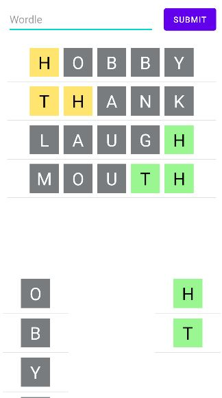

# Android Wordle App

## Description
Android wordle app written in Kotlin.
### What is Wordle?
Wordle is a game where the player guesses a 5-letter random word by summiting a possible word iteratively.    
After submitting a guess, the player receives feedback in the form of colored letters.   
* Gray color indicates that the letter is __not in__ the target word.    
* Yellow color indicates that the letter is __in__ the target word, but the order of the letter was __not correct__.    
* Green color indicates that the letter is __in__ the target word, and the order of the letter was __correct__.

